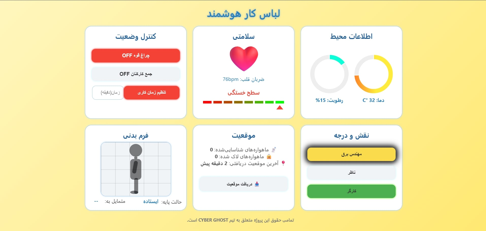

# 👕🛡️ لباس کار هوشمند – آینده‌ی ایمنی و بهره‌وری در محیط‌های کاری  

  

## 🇮🇷 معرفی (فارسی)

آیا تا به حال تصور کرده‌اید لباسی داشته باشید که:  
- تشخیص دهد چه زمانی و تا چه حد خسته‌اید، و حتی پیشنهاد دهد **چقدر استراحت نیاز دارید**؟ 💤  
- در شرایط اضطراری، تنها با فشردن یک دکمه، مستقیماً کارفرما یا مدیر پروژه را از وضعیت شما مطلع کند؟ 🚨  
- اگر شما یک سرپرست یا مدیر ایمنی باشید، بتوانید بدانید:  
  - چه کسی در خطر ایست قلبی است؟ ❤️‍🔥  
  - چه کسی از ارتفاع سقوط کرده و دقیقاً در کدام نقطه پروژه گرفتار شده است؟ 🏗️  
  - چه کسی واقعاً در محل کار حضور دارد، لباس ایمنی پوشیده یا بدون اجازه کار را ترک کرده؟ 🕵️
  -   

**گروه فنی مهندسی فراویژن** دقیقاً به همین موارد فکر کرده است.  

ما با پیاده‌سازی الگوریتم‌های پیشرفته و استفاده از سنسورهای متنوع، موفق به طراحی و ساخت **لباس کار هوشمند** شده‌ایم؛ یک گجت پوشیدنی ماژولار که نه تنها ایمن و کاربردی است، بلکه مقرون‌به‌صرفه بوده و قابلیت نصب روی هر نوع لباس کاری را دارد.  

### 🔧 قابلیت‌ها
- 🟢 رطوبت و دمای محیط  
- 🔵 ضربان قلب  
- 🟢 سطح خستگی و تحلیل وضعیت جسمی  
- 🔵 تشخیص سقوط از ارتفاع  
- 🟡 فرم و حالت بدنی  
- 🟢 موقعیت‌یابی لحظه‌ای  
- 🔵 تشخیص پوشیدن لباس  
- 🟠 تعیین نقش و درجه پرسنل  
- 🔴 کلید اضطراری  
- 🟢 تنظیم زمان کاری و استراحت  
- 🔵 چراغ قوه هوشمند  
- 🟡 قابلیت جمع‌آوری کارکنان  
- 🟢 شارژ با نور خورشید  
- 🔵 شارژ با گام برداشتن (Kinetic Charging)  
- 🟠 پورت شارژ موبایل (کابل و وایرلس)  
- 🟡 پنل کاربری هوشمند  

### 🌀 راهکار ماژولار
در نگاه اول، شاید چنین قابلیتی فقط در یک لباس خاص امکان‌پذیر به نظر برسد. اما محدودیت‌هایی مثل شست‌وشو، تنوع لباس‌های کاری در صنایع مختلف و هزینه‌های بالا، چالش‌برانگیز هستند.  
تیم **فراویژن** با نگاهی خلاقانه این مسئله را حل کرده است:  
ما یک **گجت هوشمند ماژولار** طراحی کرده‌ایم که به‌راحتی روی هر نوع لباس کاری نصب می‌شود، جداشدنی، مقاوم و کاملاً انعطاف‌پذیر است.  

این فناوری پلی است میان **ایمنی، نوآوری و صرفه‌جویی اقتصادی** در محیط‌های کاری

  

# ⛑️🎥 کلاه کار هوشمند – چشم همیشه بیدار در محیط‌های کاری 

پروژه‌ی **کلاه هوشمند کار** را توسعه داده است؛ یک تجهیز پوشیدنی پیشرفته که برای **ایمنی بیشتر، نظارت دقیق‌تر و افزایش بهره‌وری** در محیط‌های کاری طراحی شده است.  

این کلاه با ترکیب **دوربین ثبت وقایع**، **ارسال آنلاین تصویر و ویدیو** و **چراغ هوشمند شبانه**، به سرپرستان و مدیران ایمنی امکان می‌دهد تا از وضعیت لحظه‌ای کارگاه و کارکنان خود آگاه باشند.  

### ⚙️ قابلیت‌ها
- 🎥 **دوربین ثبت وقایع** (Event Recording Camera)  
- 📡 **ارسال زنده تصویر و ویدیو** به مرکز کنترل  
- 💡 **چراغ هوشمند برای کار در شب و محیط‌های کم‌نور**   
- 🟠 **ارتباط دوطرفه تصویری با مرکز کنترل**  
- 🟡 **حافظه داخلی برای ذخیره‌سازی حوادث**  
- 🟢 **باتری هوشمند با مدیریت مصرف انرژی**  

### 🧩 طراحی ماژولار
- ✅ قابل استفاده روی انواع کلاه ایمنی استاندارد  
- ✅ مقاوم در برابر ضربه و شرایط سخت محیطی  
- ✅ اتصال آسان به سیستم HSE و کنترل پروژه  
- ✅ مقرون‌به‌صرفه و انعطاف‌پذیر
   

  

---

## 🇬🇧 Introduction (English)

Have you ever imagined workwear that can:  
- Detect when you are fatigued and even **suggest how much rest you need**? 💤  
- In an emergency, notify your employer instantly with the press of a single button? 🚨  
- If you are a supervisor or safety manager, tell you:  
  - Who is at risk of cardiac arrest? ❤️‍🔥  
  - Who has fallen from a height and at exactly what location on the site? 🏗️  
  - Who is present on-site, properly wearing workwear, or has left without authorization? 🕵️  

**Faravision Engineering Group** has turned this vision into reality.  

By implementing advanced algorithms and integrating a wide range of sensors, we developed the **Smart Workwear** — a modular wearable gadget that is **safe, cost-effective, and universally compatible** with all types of work uniforms.  

### 🔧 Features
- 🟢 Environmental monitoring (humidity & temperature)  
- 🔵 Heart rate tracking  
- 🟢 Fatigue & body condition analysis  
- 🔵 Fall detection  
- 🟡 Posture monitoring  
- 🟢 Real-time location tracking  
- 🔵 Wear detection  
- 🟠 Role & rank assignment  
- 🔴 Emergency button  
- 🟢 Work-time & rest-time management  
- 🔵 Smart flashlight  
- 🟡 Workforce gathering function  
- 🟢 Solar charging  
- 🔵 Kinetic charging (step-powered)  
- 🟠 Mobile charging port (wired & wireless)  
- 🟡 Smart control panel  

### 🌀 Modular Approach
While such features may seem feasible only in a dedicated uniform, real-world challenges such as **washing limitations, clothing diversity across industries, and high costs** make it impractical.  

The **Faravision team** solved this with a **modular wearable gadget** that is detachable, robust, flexible, and installable on **any workwear type**.  

This solution bridges the gap between **technology, safety, and economic efficiency** in workplaces.  

---

## 👨‍💻 توسعه‌دهندگان / Developers
- امیرمهدی براتی – *AmirMahdi Barati*  
- مهدی ابوطالبی – *Mahdi Aboutalebi*  

---

## 🎯 Vision
Building a future where **safety meets intelligence**, empowering both workers and managers with **real-time insights and proactive protection**.  

---

## 📌 License & Contribution
This project is open for collaboration 🤝  
Feel free to fork, contribute, and enhance via Pull Requests.   

---

introduces the **Smart Work Helmet** — an advanced wearable designed to enhance **safety, supervision, and productivity** in industrial and construction environments.  

Equipped with an **event recording camera**, **real-time video streaming**, and a **smart night lamp**, it empowers supervisors and HSE managers to maintain live awareness of site conditions and worker safety.  

### ⚙️ Features
- 🎥 **Event Recording Camera**  
- 📡 **Live video & image streaming** to the control center  
- 💡 **Smart lamp for night work & low-light conditions**  
- 🟢 **Real-time positioning (GPS/RTLS)**  
- 🔴 **Emergency SOS button**  
- 🟠 **Two-way audio/video communication with control**  
- 🟡 **Local storage for incidents**  
- 🟢 **Smart battery with power optimization**  

### 🧩 Modular Design
- ✅ Compatible with all standard safety helmets  
- ✅ Rugged & impact-resistant for harsh environments  
- ✅ Easy integration with HSE & project control systems  
- ✅ Cost-effective and flexible 
📜 Licensed under **MIT License**.  

---

⭐ اگر این پروژه براتون الهام‌بخش بود، لطفاً با **Star** از ما حمایت کنید!  
